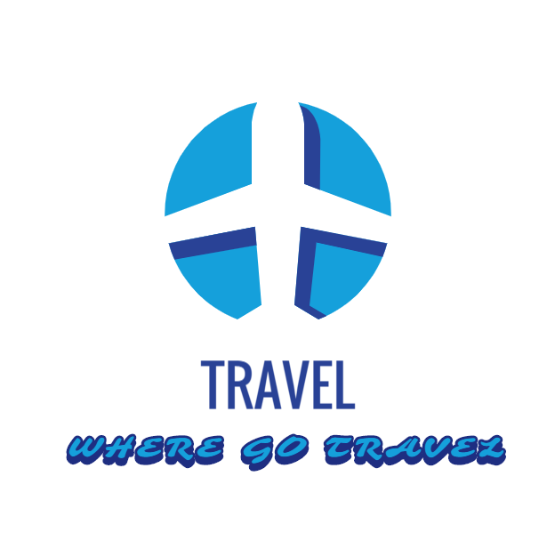

<p align="center">
  
</p>
<p align="center">
  <a href="https://github.com/vuejs/vue">
    
  </a>
  <a href="https://github.com/251205668/Travel">
    
  </a>
<a href="https://router.vuejs.org/">
    
  </a>
  <a href="https://vuex.vuejs.org/">
    
  </a>
</p>

## :newspaper:前言
通过学习了慕课上面`Delllee`的课程，让我基本上入门了vue，这也是在学习中产生的作品，但是老师实现的比较简单，没有深入，所以我在这个项目的基础上完善了功能。
>如果想学习此课程，请认准正版课程学习[地址](https://coding.imooc.com/class/203.html)


## :flags:项目目标
近乎完美的实现去哪旅行app里面的景点门票板块,这是最大的心愿,官网请参考[去哪儿](https://touch.piao.qunar.com/?bd_source=qunar&ouid=),我目前完成的并部署在服务器上的地址[Travel](http://47.97.180.232/#/)
> 最近比较忙,项目暂时用的前端mock数据,后续接入api数据抓取线上数据

## :clipboard:目录结构

```markdown
├── README.md
├── build
│   ├── build.js
│   ├── check-versions.js
│   ├── utils.js
│   ├── vue-loader.conf.js
│   ├── webpack.base.conf.js
│   ├── webpack.dev.conf.js
│   └── webpack.prod.conf.js
├── config
│   ├── dev.env.js
│   ├── index.js
│   └── prod.env.js
├── index.html
├── package.json
├── src
│   ├── App.vue
│   ├── assets
│   │   ├── styles
│   │   │   ├── iconfont
│   │   │   ├── border.css
│   │   │   ├── iconfont.css
│   │   │   ├── reset.css
│   │   │   ├── varibles.styl
│   │   │   └── mixins.styl
│   ├── common
│   │   ├── fade
│   │   │   ├── Fade.vue
│   │   ├── gallary
│   │   │   ├── Gallery.vue
│   ├── pages
│   │   ├── home
│   │   │   ├── components
│   │   │   │   ├── Header.vue
│   │   │   │   ├── icons.vue
│   │   │   │   ├── recommend.vue
│   │   │   │   ├── swiper.vue
│   │   │   │   └── weekend.vue
│   │   │   └── Home.vue
│   │   ├── city
│   │   │   ├── components
│   │   │   │   ├── Alphabet.vue
│   │   │   │   ├── citylist.vue
│   │   │   │   ├── Header.vue
│   │   │   │   └── search.vue
│   │   │   └── City.vue
│   │   ├── home
│   │   │   ├── components
│   │   │   │   ├── Banner.vue
│   │   │   │   ├── Header.vue
│   │   │   │   └── list.vue
│   │   │   └── Detail.vue
│   ├── main.js
│   ├── router
│   │   └── index.js
│   └── store
│       ├── index.js
│       └── state.js
└── static
    └── mock
        ├──city.json
        └──index.json
   
```


## :hammer:如何运行项目

```bash
# fetch
git clone https://github.com/251205668/Travel.git

# install dependence
npm install

# run
npm run dev

# build
npm run build

```
**vue初学者项目,请勿拍砖哈哈,项目正在完善中**

## :computer:项目技术栈
- Vue全家桶
- js-ES6
- Stylus
- webpack3
- ESlint
- API(后面会加)

## :loop:目标功能
- [ ] 首页加载页面
- [ ] 账号密码登录
- [ ] 找到一个合适的api
- [x] 实现首页轮播
- [x] 实现推荐区域展示
- [x] 实现导航轮播
- [x] 实现周末去哪儿展示
- [x] 猜你喜欢页面
- [ ] 导航按钮的详情页
- [ ] 热销推荐详情页
- [ ] 周末去哪儿详情页
- [ ] 订单详情页面
- [ ] 订单填写提交页面
- [ ] 经典详情页评论页面
> 目前只想到这么多,后续可以向我提issue提供新功能

## :bookmark_tabs:部分项目展示图
### 首页图


### 城市页面


### 详情页面


## :notebook_with_decorative_cover:开发文档
关于这项目我在学习本课程时练习了两遍,之间记录了详细笔记,后面补上。。。[文档笔记](https://251205668.github.io/)

## :golf:总结
我想当完成了这个项目,`vue`算是完全入门了,并提升了自己的js能力,组件化思想，向大前端又迈出了一大步,但这都是基于项目完成了的条件下HH。

##  :two_men_holding_hands: 由衷感谢
**Delllee**老师指导的非常详细 师父领进门，修行在个人，由衷感谢
课程链接:[Delllee的去哪儿旅行课程](https://coding.imooc.com/class/203.html)
## :guardsman:作者:努力中的杨先生
